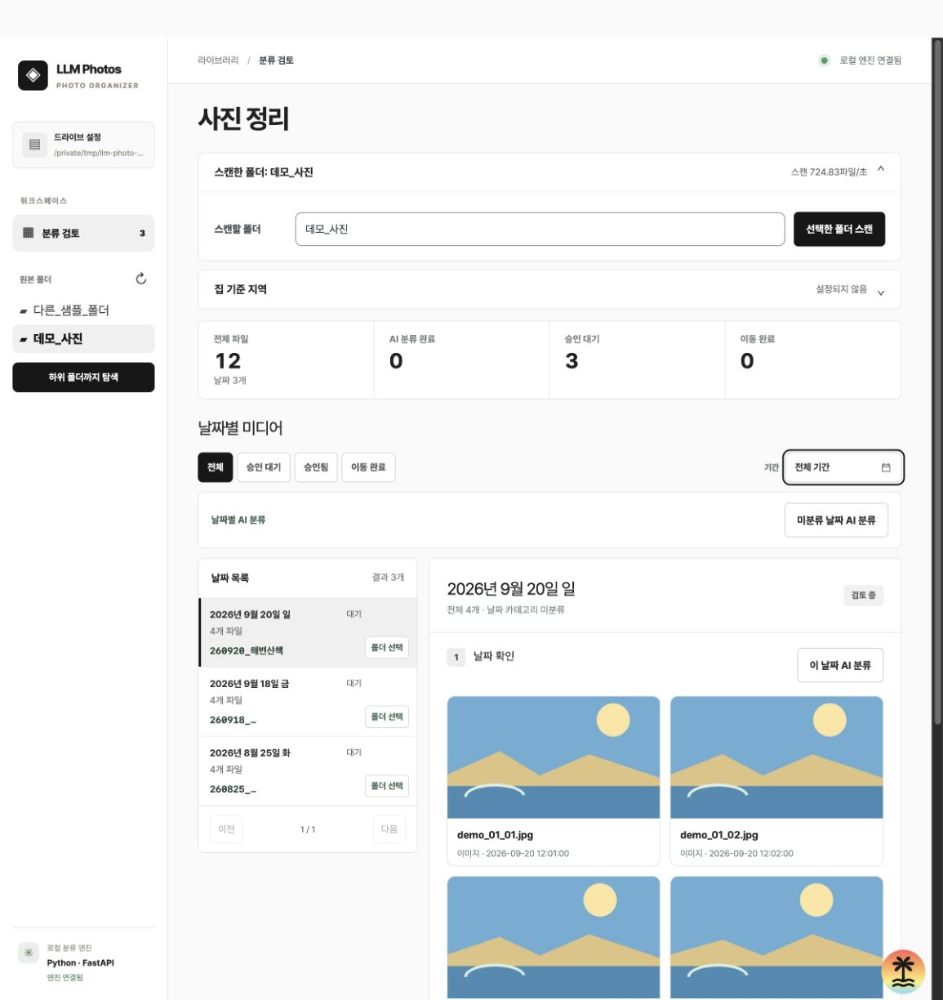
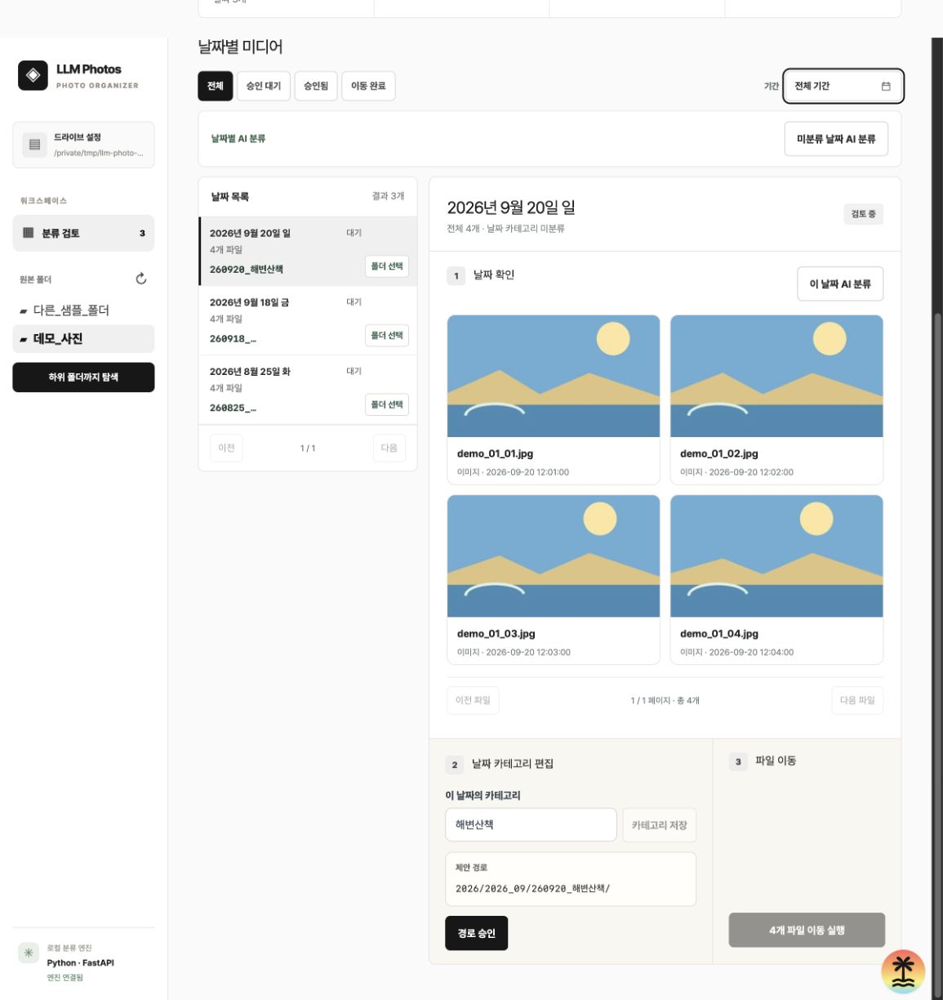
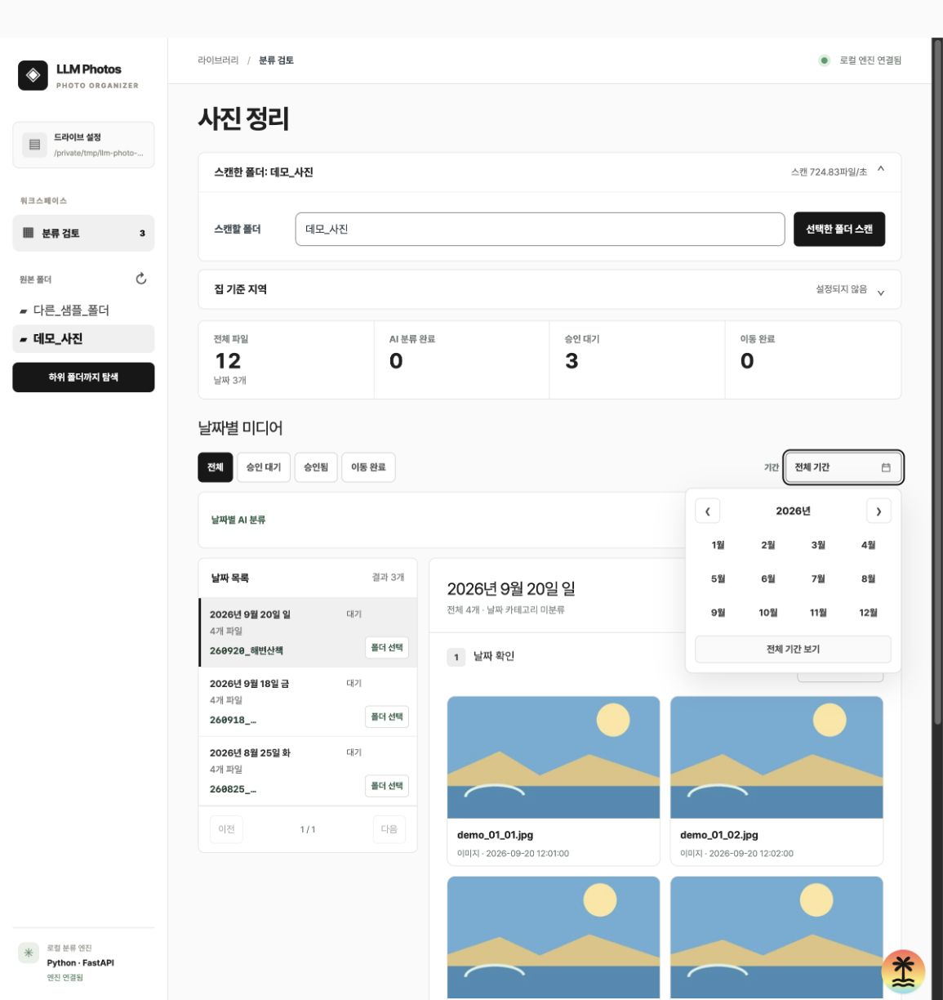
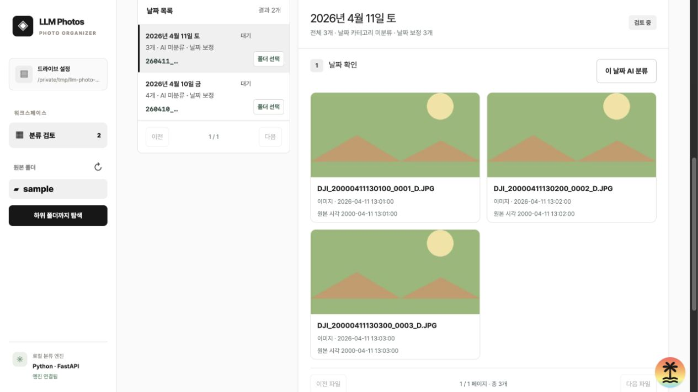

# LLM Photo Organizer

**몇만 장의 사진과 영상을 날짜별로 검토하고, 직접 승인한 경로로만 정리하는 로컬 웹앱.**

TanStack Start와 React가 검토 화면을, Python·FastAPI·uv가 폴더 탐색, 메타데이터 추출, MiniCPM-V-4.6 호출, 승인된 파일 이동을 담당합니다. 원본 파일명은 바꾸지 않습니다.

> **선택 → 탐색 → 날짜별 분류 → 폴더명 편집 → 경로 승인 → 이동 실행**
> 폴더 선택이나 AI 분류만으로는 파일이 이동하지 않습니다.

## 화면 미리보기

아래 화면은 개인 미디어 대신 **임시 폴더에 만든 가상 이미지 12장**으로 캡처했습니다. 실제 드라이브의 사진, 경로, 모델 주소는 포함하지 않았습니다.

### 원본 폴더 선택과 탐색

왼쪽 워크스페이스에서 폴더를 고르거나 **스캔할 폴더 칸**을 눌러 macOS 폴더 선택창을 열 수 있습니다. 선택 후 **선택한 폴더 스캔**을 눌러야 하위 폴더까지 재귀적으로 읽습니다.



### 날짜별 검토

날짜 목록에서 각 날짜의 제안 폴더명을 확인하고 수정할 수 있습니다. 대표 미디어를 본 뒤 날짜 전체에 적용할 카테고리를 저장합니다.
이미지나 영상 카드를 누르면 크게 볼 수 있고, 영상은 모달의 재생 컨트롤로 확인합니다.



### 월 필터

브라우저 기본 달력 대신 연도 이동과 12개월을 한눈에 볼 수 있는 선택창을 사용합니다. 필터를 바꾸어도 스캔이나 파일 이동은 일어나지 않습니다.



## 동작 방식

| 단계 | 사용자가 확인하는 것 | 파일에 미치는 영향 |
| --- | --- | --- |
| **1. 원본 선택** | macOS 선택창 또는 워크스페이스의 폴더 | 없음 |
| **2. 탐색** | 선택 폴더의 하위 미디어, 날짜, 스캔 속도와 중단 버튼 | 읽기만 함 |
| **3. 날짜별 AI 분류** | 대표 이미지·영상, 장소 근거, 제안 카테고리 | 없음 |
| **4. 폴더명 편집** | `YYYY/YYYY_MM/YYMMDD_카테고리/` 또는 해당 날짜의 기존 폴더 | 없음 |
| **5. 경로 승인** | 이동할 대상 경로 | 없음 |
| **6. 이동 실행** | 승인한 날짜의 파일 | 이 단계에서만 이동 |

각 날짜는 하나의 카테고리를 가집니다. AI는 날짜 전체에서 고른 대표 파일 최대 6개를 한 번에 보고 제안하며, 영상은 요청당 최대 32프레임으로 제한합니다. 날짜 안에 서로 다른 내용이 섞여 있을 수 있으므로 미리보기와 제안 경로를 확인해야 합니다. 분류 결과는 경로를 승인하지 않습니다. 승인 후 카테고리나 폴더명을 바꾸면 승인이 해제됩니다.

원본 폴더 하나에 여러 날짜의 파일이 섞여 있어도 촬영 날짜별로 나누어 검토합니다. DJI 영상은 파일명과 영상 메타데이터의 시각을 비교해 사진과 같은 날짜로 묶습니다. 카메라 시계가 틀렸다면 `DATE_YEAR_CORRECTION`으로 **한 원본 폴더에만** 연도 보정을 적용할 수 있습니다. 보정된 파일은 원래 촬영 시각도 화면에 표시되며, 경로를 승인하기 전에 날짜를 확인할 수 있습니다.



*임시 생성 샘플로 촬영한 화면입니다. 실제 사진은 포함하지 않습니다.*

사진의 EXIF와 지원되는 영상 위치 태그에서 GPS를 읽습니다. **집 기준 지역**을 UI에서 입력하면 GPS와 함께 모델 문맥에 전달해 장소와 여행 카테고리를 제안하는 데 활용합니다. GPS가 없더라도 표지판이나 뚜렷한 랜드마크가 보이면 AI가 장소를 추정할 수 있으며, 화면에 추정 근거를 표시합니다. 집에서 멀다는 사실만으로 여행을 확정하지는 않습니다. 장소 힌트는 로컬 [지명 자료](engine/PLACES.md)를 사용합니다.

대용량 목록을 위해 날짜는 **30개씩**, 선택 날짜의 파일은 **24개씩** 불러옵니다. **AI 미분류** 필터로 아직 분류하지 않은 날짜만 볼 수 있습니다. 날짜별 AI 일괄 분류에는 진행률, 실패 수, 처리 속도가 표시되고 현재 요청이 끝난 뒤 중지할 수 있습니다. 스캔 속도는 파일/초, AI 속도는 날짜/초로 표시됩니다.

스캔 중 **스캔 중단**을 누르면 현재 파일 확인을 마친 뒤 탐색을 멈춥니다. 중단한 스캔의 일부 결과는 검토 목록에 반영하지 않고 이전 목록을 유지합니다.

## 로컬 실행

### 준비물

- Node.js 20 이상, npm
- Python 3.12 이상, [uv](https://docs.astral.sh/uv/)
- `ffmpeg`, `ffprobe` (영상 프레임과 메타데이터)
- JSON 스키마 응답을 지원하는 OpenAI 호환 MiniCPM-V-4.6 vLLM 서버

```sh
npm install
uv sync
cp engine/.env.example engine/.env
```

`engine/.env`의 `PHOTO_ROOT`에 선택 가능한 폴더의 상위 경로를 설정합니다. 외장하드 이름 **X31은 이 드라이브 설정에서만** 사용합니다. `MODEL_API`에는 본인이 쓰는 vLLM 주소를 입력합니다. 이 파일은 Git에서 제외됩니다.

터미널 두 개에서 각각 실행합니다.

```sh
npm run engine
```

```sh
npm run dev
```

브라우저에서 [http://127.0.0.1:3000](http://127.0.0.1:3000)을 엽니다. 기본 엔진 주소는 `127.0.0.1:8040`입니다. 로컬 테스트는 실제 드라이브 대신 임시 샘플 폴더를 `PHOTO_ROOT`로 지정해 실행합니다.

| 설정 | 기본값 | 용도 |
| --- | --- | --- |
| `PHOTO_ROOT` | 필수 | 선택 가능한 원본 폴더의 상위 경로 |
| `MODEL_API` | `http://127.0.0.1:8000/v1` | OpenAI 호환 vLLM API 기본 주소 |
| `MODEL_NAME` | `openbmb/MiniCPM-V-4.6` | 모델 이름 |
| `ENGINE_BIND` / `ENGINE_PORT` | `127.0.0.1` / `8040` | 로컬 엔진 주소 |
| `VITE_ENGINE_ORIGIN` | `http://127.0.0.1:8040` | 브라우저에서 접근하는 엔진 주소 |
| `DATE_YEAR_CORRECTION` | 없음 | `폴더명:원래연도:보정연도` 형식, 지정한 원본 폴더에만 적용 |

## 확인과 주의사항

```sh
npm run test:e2e
npx tsc --noEmit
npm run build
```

테스트는 E2E만 사용합니다. E2E 서버는 실제 드라이브와 개인 설정을 읽지 않고 임시 사진을 만들어 별도 포트에서 브라우저로 폴더 선택, 재귀 탐색, 날짜 보정, 경로 승인, 별도 이동을 확인합니다.

- 디렉터리 링크와 선택한 원본 밖으로 이어지는 경로는 탐색하지 않습니다. 이동 직전에도 원본과 대상 경로를 다시 확인합니다.
- 검토, 스캔, 분류 진행 상태는 현재 엔진의 메모리에 있습니다. 엔진을 재시작하면 다시 탐색해야 합니다. 이동 중 파일시스템 오류가 나면 폴더를 직접 확인한 후 재시도하세요.
- 집 기준 지역은 Git에서 제외되는 `engine/.local-settings.json`에 저장됩니다. API 주소, 개인 설정, 미디어 및 생성 데이터도 Git에 포함하지 않습니다.
- 실제 외장 드라이브의 자동 탐색이나 이동은 하지 않습니다. 퍼블릭 저장소 생성과 push는 별도 공개 승인 후에만 진행합니다.

UI 구성과 검토 기준은 [DESIGN.md](DESIGN.md)에 정리했습니다.
